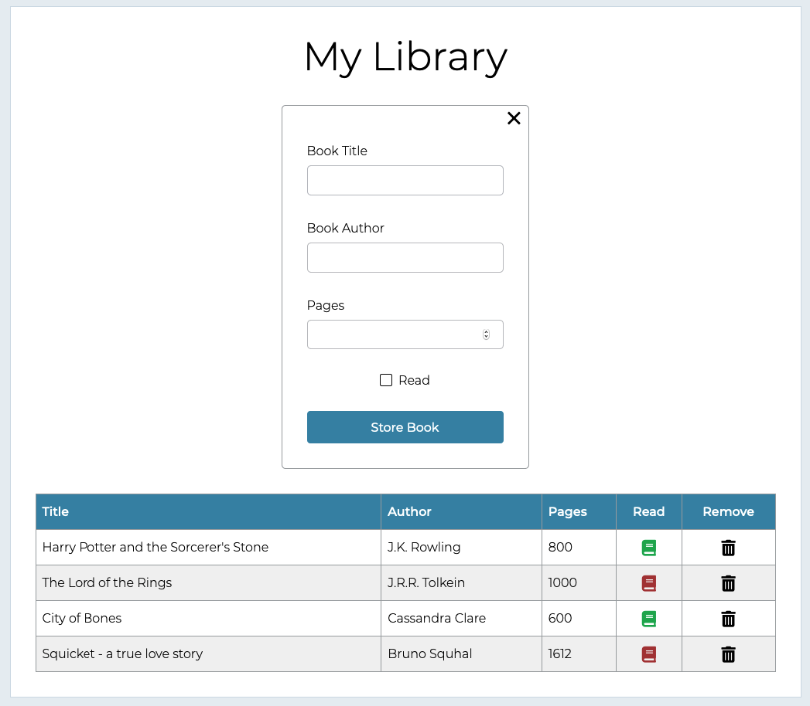

# Book Library
Book library app created with HTML, CSS & Javascript for The Odin Project.

## Demo
Here is a working live demo: https://kapaha.github.io/book-library/

## General info
This project was created as a part of the [Javascript](https://www.theodinproject.com/courses/javascript/lessons/library) course with [The Odin Project](https://theodinproject.com). The aim of this project was to combine the knowledge of HTML, CSS & Javascript I have learnt throughout the course.

## Features
* Add books to your library - your books are saved in local storage on your browser
* Change the read status of added books - click the book icon to toggle read status
* Remove unwanted books - click the bin icon to remove book
* Responsive design - Works on desktop, tablet and mobile

## Built with
* HTML
* CSS
* Javascript

## Status
The project is finished, however I may continue to improve on it as my knowledge of web development improves.
